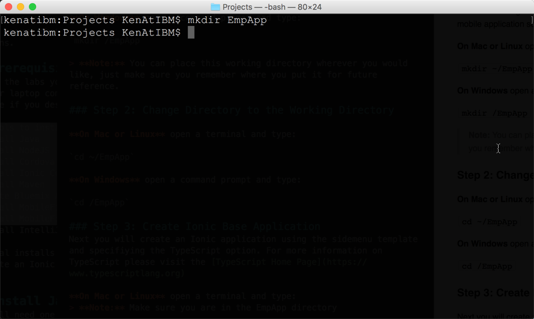
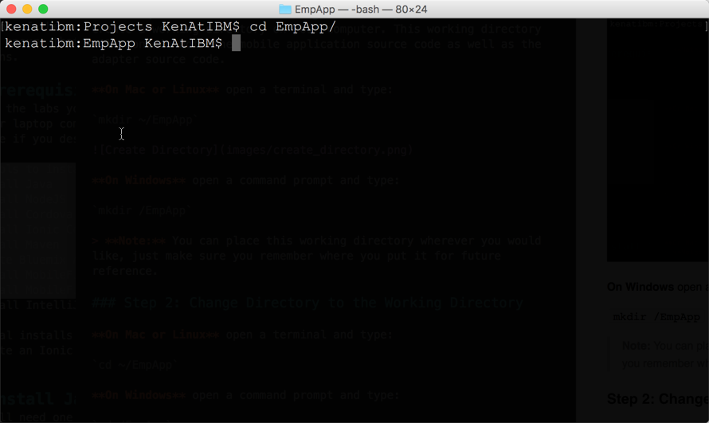
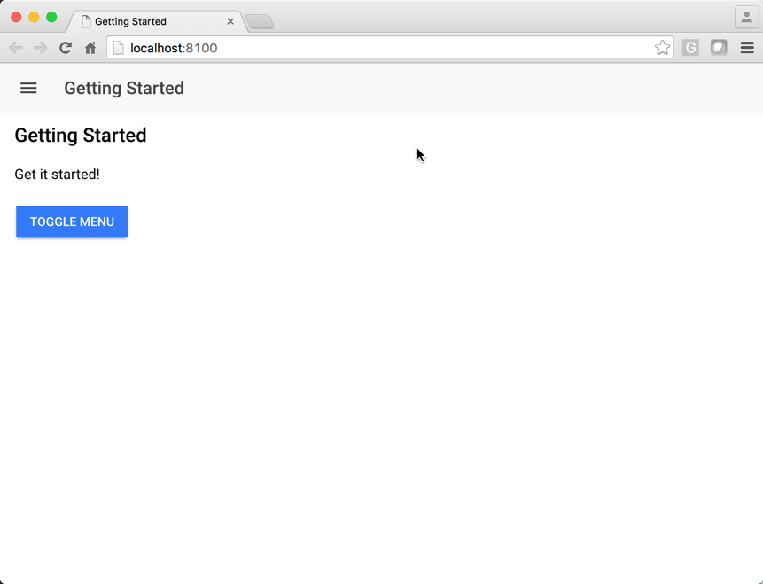
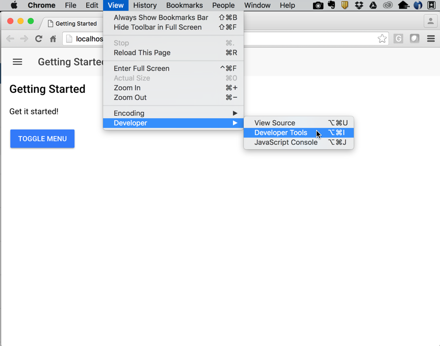
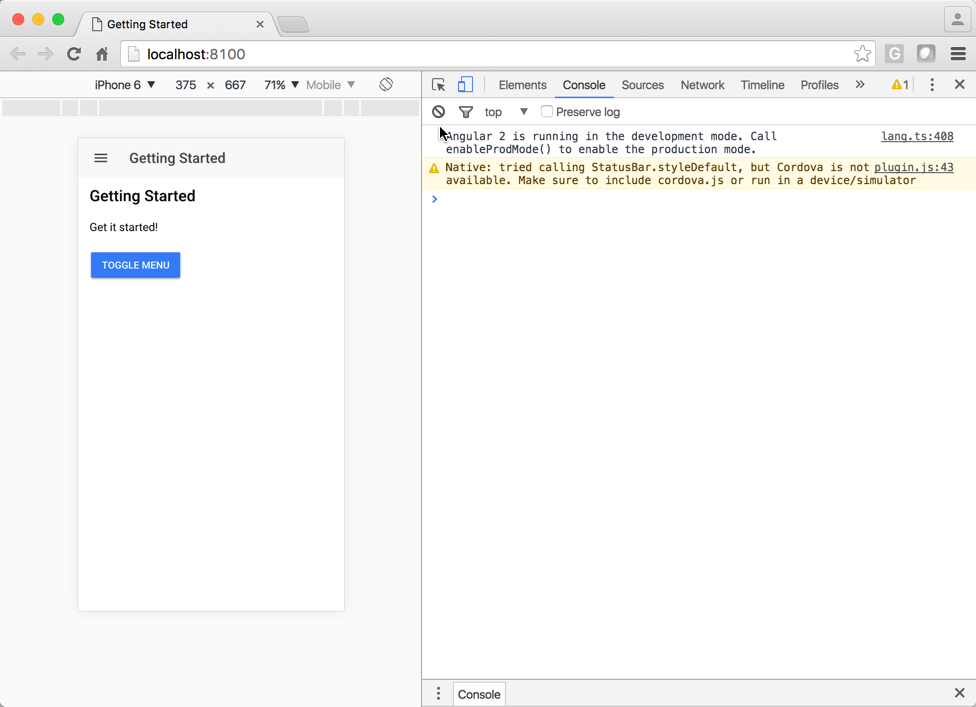
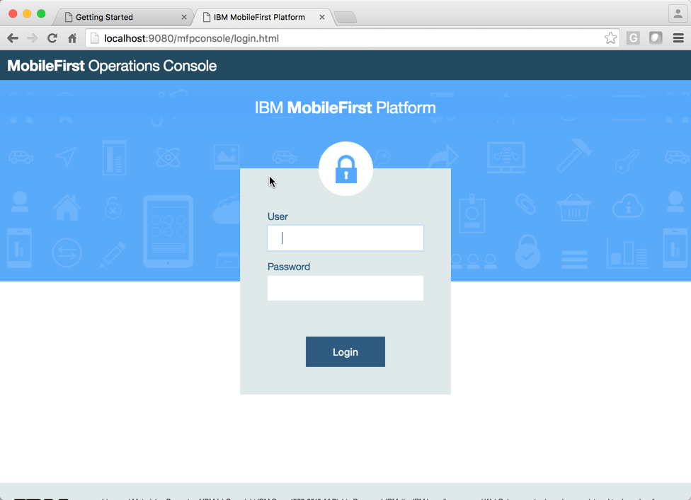
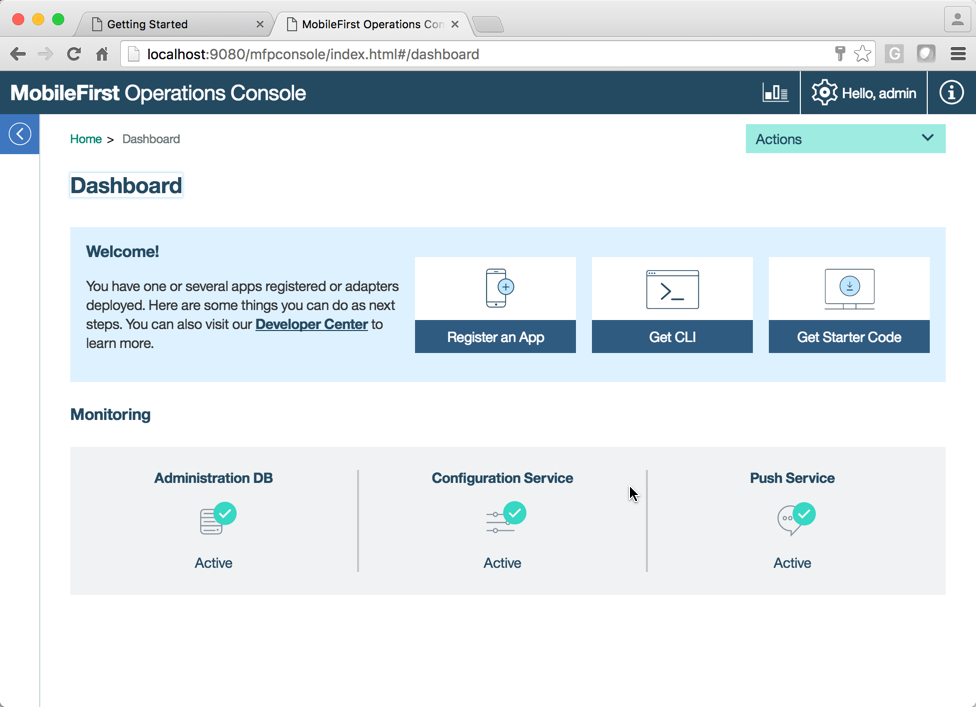
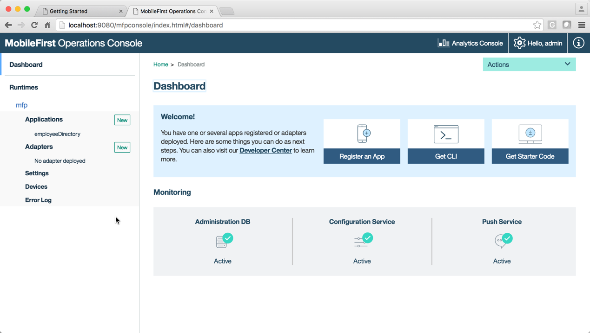

# IBM MobileFirst Platform 8 w/Ionic 2


## Tools that will be required

The tools to install include:

- Install Java
- Install NodeJS
- Install Cordova
- Install Ionic Command-Line-Utility
- Install Gulp
- Install cdvLive
- Install Maven
- Create Bluemix Account
- Install MobileFirst 8.0 beta Command Line Utility
- Install MobileFirst 8.0 beta Development Kit
- Install Android Studio
- Install XCode (Mac only)
- Install Google Chrome
- Install your favorite IDE.

### Install Java
You will need one of the following installed:
- Oracle JVM 1.7u55+
- Oracle JVM 1.8u20+
- IcedTea OpenJDK 1.7.0.55+

To Install Oracle Java on a Mac or Windows Machine visit http://www.oracle.com/technetwork/java/javase/downloads/jdk8-downloads-2133151.html. The current version as of the April 11, 2016 is 8u77.

Download from the section that reads: Java SE Development Kit 8u77. Accept the License Agreement to enable the selection and download of the appropriate installation.

To install IcedTea OpenJDK on a Debian, Ubuntu, Fedora, Oracle Linux or Red Hat Linux machine visit http://openjdk.java.net/install/index.html and follow the instructions to download and install.

### Install NodeJS
There are two current stable builds of NodeJS as of 4/11/2016. Download and install version 4.4.2 or the Stable LTS version. We do not recommend installing 5.10.1

Visit `https://nodejs.org/en/download/` and download the version that matches your operating system. 

#### Confirm installation
After the install you will want to confirm that the installation was successful. **On Mac or Linux** open a terminal or **On Windows** open a command prompt and type `node -v`.

### Install Cordova
Once node is installed you can use npm to install Cordova. The current version as of 4/11/2016 is 6.1.1

1. To determine your version of Cordova if you have one previously installed open a command prompt (Windows) or terminal (Mac/Linux) and type `cordova -v`.

1. To install Cordova if it is not currently installed or is a later version:

	**On Mac or Linux** open a terminal and type:

	`sudo npm install -g cordova`

	**On Windows** open a command prompt and type:

	`npm install -g cordova`

1. Confirm the correct version by typing `cordova -v`


### Install Ionic Command-Line-Utility
You will need the Ionic Command-Line-Utility to complete the labs. To install the Ionic Command-Line-Utility you will again use npm. As of 4/11/2016 the current version of Ionic is 1.7.14

1. To install Ionic if it is not currently installed or is a later version:

	**On Mac or Linux** open a terminal and type:

	`sudo npm install -g ionic@beta gulp cdvlive`

	**On Windows** open a command prompt and type:

	`npm install -g ionic@beta gulp cdvlive`

1. Confirm the correct version by typing `ionic -v`

> **Note:** If you have a previous install of Ionic, you may need to remove that version before installing the beta version.

### Install Gulp (Optional)
Gulp should have been installed with the Ionic framework in the previous step. If it was, you can skip this step.

Gulp will be used to provide real-time application builds. For more information on Glup please visit [http://gulpjs.com](http://gulpjs.com) or [Installation instructions](https://github.com/gulpjs/gulp/blob/master/docs/getting-started.md)

1. To install glup

	**On Mac or Linux** open a terminal and type:

	`sudo npm install -g gulp`

	**On Windows** open a command prompt and type:

	`npm install -g gulp`


### Install cdvlive
cdvlive should have been installed with the Ionic framework in a previous step. If it was, you can skip this step.

cdvlive provides a live reload of your application after it has been built. For more information on cdvLive please visit the [cdvlive npm site](https://www.npmjs.com/package/cdvlive)

1. To install cdvlive

	**On Mac or Linux** open a terminal and type:

	`sudo npm install -g cdvlive cordova`

	**On Windows** open a command prompt and type:

	`npm install -g cdvlive cordova`

### Install Maven
The current version of Maven as of 4/11/2016 is 3.3.9. For more information on installing Maven, please visit https://maven.apache.org/install.html

1. Download the Maven binary `apache-maven-3.3.9-bin.tar.gz` or `apache-maven-3.3.9-bin.zip` from https://maven.apache.org/download.cgi

1. Unpack the tar or zip file.

#### For Mac
1. Move the contents of the upacked directory. Open a terminal and type:

	`mv /Users/[myuser]/Downloads/apach-maven* /opt/`
	
	Replacing the `[myuser]` with your computer user name.

1. Edit your .profile to add the location of maven to your path. Open a terminal and type:

	`pico $HOME/.profile`
	
1. Enter the following on a new line or update your existing path statement:
	`export PATH=$PATH:/opt/apache-maven-3.3.9/bin`
	
1.	Ctrl-O to write the file

1.	Ctrl-X to exit pico editor

1.	Make the path available. Type

	`source $HOME/.profile`
	
	This will run the profile and make the new path available.
	
1. Verify the installtion. Type

	`mvn -v`
	
	This should return something like
	
	```
	Apache Maven 3.3.9 (bb52d8502b132ec0a5a3f4c09453c07478323dc5; 2015-11-10T08:41:47-08:00)
Maven home: /opt/apache-maven-3.3.9
Java version: 1.8.0_60, vendor: Oracle Corporation
Java home: /Library/Java/JavaVirtualMachines/jdk1.8.0_60.jdk/Contents/Home/jre
Default locale: en_US, platform encoding: UTF-8
OS name: "mac os x", version: "10.11.4", arch: "x86_64", family: "mac"
```

#### For Windows
1. Instead of re-writing the example of how to install Maven on Windows, follow this tutorial: http://www.mkyong.com/maven/how-to-install-maven-in-windows/

> **Note:** Since you have already installed Java, you can skip that portion of the tutorial on mkyong.com.

### Create a Bluemix Account
Please ensure that you have created a Bluemix account and that you can log into it. If you have not created a Bluemix account please do so using your IBM id at https://console.ng.bluemix.net/registration/

A Bluemix account is required to complete the installation instructions as well as the labs.

### Install MobileFirst 8.0 beta Command Line Utility

The development version of the MobileFirst Command Line Utility is now available as an npm install. This version can coexist with previous versions of the MobileFirst Command Line Utility.

To install the MobileFirst CLI Version 8.0 Beta, open a terminal or command prompt and type 

```npm install -g mfpdev-cli```

You can confirm the installation by typing

```mfpdev -v```

You should see something similar to

`8.0.0-201603280000`

### Install MobileFirst 8.0 beta Development Kit
IBM MobileFirst Platform Foundation v8.0 beta consists of the following components: MobileFirst Server & MobileFirst Operations Console, MobileFirst Command-line Interface (CLI), MobileFirst client SDKs and MobileFirst adapter tooling.

These components can be installed either seperately via online repositories which contain the latest releases, or downloaded bundled together through the MobileFirst Platform Foundation Development Kit Installer, for future or offline use.

> **Note:** That you installed the CLI (Command-Line-Interface) from npm in the previous step and so you will not need to re-install the MFP CLI.

### Install Google Chrome
### Install your favorite IDE

You will need an IDE to complete the labs and there is no right solution, however the labs below will be showing using WebStorm. IDEs that you can use are:

- [WebStorm](https://www.jetbrains.com/webstorm/) (Commercial): https://www.jetbrains.com/webstorm/
- [Atom](https://atom.io) (Open Source)
- [Visual Studio Code](https://code.visualstudio.com) (Open Source)
- [Brackets](http://brackets.io) (Open Source)

## Steps
These labs are loosely based on a subset of the Hybrid Messenger lab found on the MobileFirst Developer Site. The Bybrid Messenger Lab can be found on the [MobileFirst Platform Foundation 8.0 Labs Site](https://mobilefirstplatform.ibmcloud.com/labs/developers/8.0/hybridmessenger/)


This lab will use IBM MobileFirst 8.0 Beta with Ionic 2 to create an employee directory mobile applicaiton that will be deployed on an Android simulator and iOS Simulator (if running on a Mac).

### Step 1: Create a Working Directory
Create a working directory on your computer. This working directory will contain both the mobile application source code as well as the adapter source code.

**On Mac or Linux** open a terminal and type:

`mkdir ~/EmpApp`



**On Windows** open a command prompt and type:

`mkdir /EmpApp`

> **Note:** You can place this working directory wherever you would like, just make sure you remember where you put it for future reference.

### Step 2: Change Directory to the Working Directory

**On Mac or Linux** open a terminal and type:

`cd ~/EmpApp`



**On Windows** open a command prompt and type:

`cd /EmpApp`

### Step 3: Create Ionic Base Application
Next you will create an Ionic application using the sidemenu template and specifiying the TypeScript option. For more information on TypeScript please visit the [TypeScript Home Page](https://www.typescriptlang.org)

**On Mac or Linux** open a terminal and type:
> **Note:** Make sure you are in the EmpApp directory

`ionic start 	employeeDirectory sidemenu --v2 --ts`

**On Windows** open a command prompt and type:
> **Note:** Make sure you are in the EmpApp directory

`ionic start 	employeeDirectory sidemenu --v2 --ts`

The `--v2` tells Ionic that we will be using version 2 of the Ionic framework.

The `--ts` tells Ionic that we will be using TypeScript instead of JavaScript.

For more information on the Ionic start command, please visit [Starting an Ionic App](http://ionicframework.com/docs/v2/cli/start/)

**Output**

When complete, your outout should look similar to the following:

```
Creating Ionic app in folder /Users/KenAtIBM/Projects/MFPF8IONIC2LAB/EmpApp/employeeDirectory based on sidemenu project
Downloading: https://github.com/driftyco/ionic2-app-base/archive/typescript.zip
[=============================]  100%  0.0s
Downloading: https://github.com/driftyco/ionic2-starter-sidemenu/archive/typescript.zip
Installing npm packages...

Adding initial native plugins
[=============================]  100%  0.0s

Adding in iOS application by default

add to body class: platform-ios
Saving your Ionic app state of platforms and plugins
Saved platform
Saved plugins
Saved package.json

♬ ♫ ♬ ♫  Your Ionic app is ready to go! ♬ ♫ ♬ ♫

Make sure to cd into your new app directory:
  cd employeeDirectory

To run your app in the browser (great for initial development):
  ionic serve

To run on iOS:
  ionic run ios

To run on Android:
  ionic run android

To test your app on a device easily, try Ionic View:
  http://view.ionic.io

New! Add push notifications, update your app remotely, and package iOS and Android apps with the Ionic Platform!
https://apps.ionic.io/signup

New to Ionic? Get started here: http://ionicframework.com/docs/v2/getting-started

kenatibm:EmpApp KenAtIBM$ 
```

###Step 4: Change Directory to Ionic Application

**On Mac or Linux** open a terminal and type:

`cd ~/EmpApp/employeeDirectory`


**On Windows** open a command prompt and type:

`cd /EmpApp/employeeDirectory`

###Step 5: Set Google Chrome as Default Browser for Ionic
Google Chrome has advanced debugging capaiblities that make it really nice for developers. To set Google Chrome as the default browser for this project, edit the `ionic.config.json` file and add a default browser option.

```json
{
  "name": "employeeDirectory",
  "app_id": "",
  "v2": true,
  "typescript": true,
  "defaultBrowser": "Google Chrome"
}
```

### Step 6: Test Ionic Application

> **Assumption:** It is assumed that you are in the working directory for the Ionic application `EmpApp/employeeDirectory`

From your terminal or command prompt type:

`ionic serve`
	
Your terminal output should look similar to the following:
	
```
kenatibm:employeeDirectory KenAtIBM$ ionic serve
WARN: ionic.config.js has been deprecated, you can remove it.

Running 'serve:before' gulp task before serve
[14:07:45] Starting 'clean'...
[14:07:45] Finished 'clean' after 16 ms
[14:07:45] Starting 'watch'...
[14:07:45] Starting 'sass'...
[14:07:45] Starting 'html'...
[14:07:45] Starting 'fonts'...
[14:07:45] Starting 'scripts'...
[14:07:45] Finished 'scripts' after 32 ms
[14:07:45] Finished 'html' after 35 ms
[14:07:45] Finished 'fonts' after 48 ms
[14:07:46] Finished 'sass' after 700 ms
7.6 MB bytes written (7.93 seconds)
[14:07:56] Finished 'watch' after 11 s
[14:07:56] Starting 'serve:before'...
[14:07:56] Finished 'serve:before' after 6.09 μs

WARN: ionic.config.js has been deprecated, you can remove it.
Running live reload server: http://localhost:35729
Watching: www/**/*, !www/lib/**/*
√ Running dev server:  http://localhost:8100
Ionic server commands, enter:
  restart or r to restart the client app from the root
  goto or g and a url to have the app navigate to the given url
  consolelogs or c to enable/disable console log output
  serverlogs or s to enable/disable server log output
  quit or q to shutdown the server and exit

ionic $
```
And Google Chrome should have opened with the following page.
 	


> **Note:** To exit the server, type `q` at the `ionic $` prompt in your terminal


### Step 7: Start Chrome Developer Tools

As mentioned previously Chrome provides the Hybrid Developer some exceptional tools. To enable developer tools in Chrome, select the **View** menu then select the **Developer** menu and finally select **Developer Tools**. This will enable the developer tools view.



### Step 8: Enable the Mobile View
With the Developer Tools view enabled, select the **Toggle device mode** button from the Developer Tools button bar. This will display the application as a mobile application. On the mobile tool bar you can change the device, the zoom ratio and more.  This example shows an iPhone 6 zoomed to 71%




### Step 9A: Add Android Platform to Project

> **Assumption:** It is assumed that you are in the working directory for the Ionic application `EmpApp/employeeDirectory`

From the terminal or command prompt type

`cordova platform add android`

Your output should look similar to the following:

```
Adding android project...
Creating Cordova project for the Android platform:
	Path: platforms/android
	Package: com.ionicframework.employeedirectory380297
	Name: employeeDirectory
	Activity: MainActivity
	Android target: android-23
Android project created with cordova-android@5.1.1
Installing "cordova-plugin-console" for android
Installing "cordova-plugin-device" for android
Installing "cordova-plugin-splashscreen" for android
Installing "cordova-plugin-statusbar" for android
Installing "cordova-plugin-whitelist" for android

               This plugin is only applicable for versions of cordova-android greater than 4.0. If you have a previous platform version, you do *not* need this plugin since the whitelist will be built in.
          
Installing "ionic-plugin-keyboard" for android
Running command: /Users/KenAtIBM/Projects/MFPF8IONIC2LAB/EmpApp/employeeDirectory/hooks/after_prepare/010_add_platform_class.js /Users/KenAtIBM/Projects/MFPF8IONIC2LAB/EmpApp/employeeDirectory
add to body class: platform-android
```
The key is that all the android cordova plugins are added.

### Step 9B: Add iOS Platform to Project

> **Assumption:** It is assumed that you are in the working directory for the Ionic application `EmpApp/employeeDirectory`.
> Also it is assumed that you are running on a Macintosh and that you have installed the latest version of Xcode.

From the terminal or command prompt type

`cordova platform add ios`

> **Note:** If you are running on a Macintosh, the ios platform may have already been added for you when you created the project. However this will throw an error when in a later section when you prepare the application. 

```
Error: Failed to prepare plug-in for ios : 
An unexpected error occurred. Contact IBM support.
```

> To fix this, remove the ios platform and re-add it. To remove the ios platform type `cordova platform remove ios`. Then re-add the ios platform using the command above.


### Step 10: Confirm Platforms have been added

> **Assumption:** It is assumed that you are in the working directory for the Ionic application `EmpApp/employeeDirectory`.

From the terminal or command prompt type

`cordova platform list`

Your output should be similar to the following:

```
Installed platforms:
  android 5.1.1
  ios 4.1.1
Available platforms: 
  amazon-fireos ~3.6.3 (deprecated)
  blackberry10 ~3.8.0
  browser ~4.1.0
  firefoxos ~3.6.3
  osx ~4.0.1
  webos ~3.7.0
```

Notice the **Installed platforms** and the **Available Platforms** The Installed platforms show which device platforms have been added to the project and the Available Platforms show the remaining platforms that can be added if neeeded.

### Step 11: Add MFP Cordova Plugin
> **Assumption:** It is assumed that you are in the working directory for the Ionic application `EmpApp/employeeDirectory`.

There are four MFP Cordova Plugins for MFPF 8. They are:

- cordova-plugin-mfp
- cordova-plugin-mfp-push
- cordova-plugin-mfp-jsonstore
- cordova-plugin-mfp-fips

The only one needed for this lab is cordova-plugin-mfp. To add the plugin type the following from you terminal or command prompt:

`cordova plugin add cordova-plugin-mfp`

Your output should be similar to the following:

```
Fetching plugin "cordova-plugin-mfp" via npm
Installing "cordova-plugin-mfp" for android
Dependent plugin "cordova-plugin-device" already installed on android.
Fetching plugin "cordova-plugin-dialogs" via npm
Installing "cordova-plugin-dialogs" for android
Fetching plugin "cordova-plugin-globalization" via npm
Installing "cordova-plugin-globalization" for android
Fetching plugin "cordova-plugin-okhttp" via npm
Installing "cordova-plugin-okhttp" for android
MainActivity.java was backed up as MainActivity.original. A MobileFirst Platform Foundation version of MainActivity.java was added. If you have made changes in the original MainActivity.java, you need to merge them with the current MainActivity.java in the /Users/KenAtIBM/Projects/MFPF8IONIC2LAB/EmpApp/employeeDirectory/platforms/android/src/com/ionicframework/employeedirectory380297 directory.
Installing "cordova-plugin-mfp" for ios
Dependent plugin "cordova-plugin-device" already installed on ios.
Installing "cordova-plugin-dialogs" for ios
Installing "cordova-plugin-globalization" for ios
cp: no such file or directory: /Users/KenAtIBM/Projects/MFPF8IONIC2LAB/EmpApp/employeeDirectory/platforms/ios/employeeDirectory/main.m

If you made changes to your main.m file, manually merge main.m.bak with the main.m file that is provided with IBM MobileFirst Platform Foundation.
```

To verify that the plugin was added, type the following in your terminal or command prompt:

`cordova plugin list`

Your output should look similar to the following:

```
cordova-plugin-console 1.0.3 "Console"
cordova-plugin-device 1.1.2 "Device"
cordova-plugin-dialogs 1.2.1 "Notification"
cordova-plugin-globalization 1.0.3 "Globalization"
cordova-plugin-mfp 8.0.2016032800 "IBM MobileFirst Platform Foundation"
cordova-plugin-okhttp 2.0.0 "OkHttp"
cordova-plugin-splashscreen 3.2.2 "Splashscreen"
cordova-plugin-statusbar 2.1.3 "StatusBar"
cordova-plugin-whitelist 1.2.2 "Whitelist"
ionic-plugin-keyboard 2.1.0 "Keyboard"
```

**Notice** the `cordova-plugin-mfp 8.0.2016032800 "IBM MobileFirst Platform Foundation"` entry.

### Step 12: Start the Local Server
This step assumes that you have installed the MobileFirst Development kit from the [MobileFirst Developer Download Page](https://mobilefirstplatform.ibmcloud.com/downloads/). **Note** this was a prerequisite.  The standard install will place the server in the User Home Directory in a directory called MobileFirst-8.0.0.0.

1. Open a new terminal or command prompt
1. Navigate to the MobileFirst-8.0.0.0 directory

	`cd ~/MobileFirst-8.0.0.0`

**For Mac or Linux**

1. Run the server using nohup command, in your terminal type

	`nohup ./run.sh &`
	
1. Command+C to exit
	
1. Tail the output by typing the following in your terminal.

	`tail -f nohup.out`

**For Windows**

1. Run the server in your command prompt by typing

	`run.bat`


### Step 13: Run MFP Console
To verify that the server is running, open a new session in your browser and type `http://localhost:9080/mfpconsole`. This should start the MFP Console and display the login page.



To login, the user is `admin` and the password is `admin`. Press the **Login** button, if successful you will see the MobileFirst Operations Console Dashboard page.



### Step 14: Register the Application

Right now in the console there are no applications listed. The next step is to register the Ionic application. To do that return to your terminal or command prompt. Ensure that you are in the ~/EmpApp/employeeDirectory directory. Type the following:

`mfpdev app register`

Since there is only one server currently registered with the application, the application will be pushed to the local MFPF server or localhost:9080. Your output should look similar to the following:

```
Verifying server configuration...
Registering to server:'http://9.16.77.183:9080' runtime:'mfp'
Updated config.xml file located at: /Users/KenAtIBM/Projects/MFPF8IONIC2LAB/EmpApp/employeeDirectory/config.xml
Run 'cordova prepare' to propagate changes.
Registered app for platform: android
Registered app for platform: ios
```

Go back to your dashboard and refresh the page.  Notice that now there is an application listed in the **Applications** section called employeeDirectory.



### Step 15: Prepare Application
> **Assumption:** It is assumed that you are in the working directory for the Ionic application `EmpApp/employeeDirectory`.

To build the application you issue a cordova prepare command. From the terminal or command prompt type

`cordova prepare`

Your output should look similar to the following

```
Running command: /Users/KenAtIBM/Projects/MFPF8IONIC2LAB/EmpApp/employeeDirectory/hooks/after_prepare/010_add_platform_class.js /Users/KenAtIBM/Projects/MFPF8IONIC2LAB/EmpApp/employeeDirectory
add to body class: platform-android
add to body class: platform-ios
```

### Step 16: Get App Registration Information
> **Assumption:** It is assumed that you are in the working directory for the Ionic application `EmpApp/employeeDirectory`.

This step will get all the configuration information created during the application registration performed in step 14. From the terminal or command prompt type

`mfpdev app pull`

Your output should look similar to the following:

```
Verifying server configuration...
Pulling Application Settings from server:'http://9.16.77.183:9080' runtime:'mfp'
Pulled Application Settings for platform: android on version 0.0.1
Pulled Application Settings for platform: ios on version 0.0.1
```

### Step 17: Push the Application to the Server with Registration Information

> **Assumption:** It is assumed that you are in the working directory for the Ionic application `EmpApp/employeeDirectory`.

This step will push the application with all the configuration information created during the application registration in step 14. From the terminal or command prompt type

`mfpdev app push`

Your output should look similar to the following:

```
Verifying server configuration...
Pushing Application Settings to server:'http://9.16.77.183:9080' runtime:'mfp'
Pushed application Settings for platform: android on version 0.0.1
Pushed application Settings for platform: ios on version 0.0.1
```

### Step 18: Start a Gulp Watch command
To ensure that the changes being made are automatically buildt, you will need to start a Gulp Watch command. To do this, start a new terminal or command prompt and ensure that you are in your `~/EmpApp/employeeDirectory` directory. Type the following command:

`gulp watch`

Your output should look similar to the following:

```
[15:40:09] Using gulpfile ~/Projects/MFPF8IONIC2LAB/EmpApp/employeeDirectory/gulpfile.js
[15:40:09] Starting 'clean'...
[15:40:09] Finished 'clean' after 17 ms
[15:40:09] Starting 'watch'...
[15:40:09] Starting 'sass'...
[15:40:09] Starting 'html'...
[15:40:09] Starting 'fonts'...
[15:40:09] Starting 'scripts'...
[15:40:09] Finished 'scripts' after 32 ms
[15:40:09] Finished 'html' after 37 ms
[15:40:09] Finished 'fonts' after 46 ms
[15:40:10] Finished 'sass' after 778 ms
7.6 MB bytes written (7.81 seconds)
[15:40:20] Finished 'watch' after 11 s
```

This will ensure that as you make changes to your source code the application is built.

### Step 15A: Test Application in Android Simulator

### Step 15B: Test Application in iOS Simulator

### Step 15: Create an Adapter

### Step 16: Publish the Adapter


